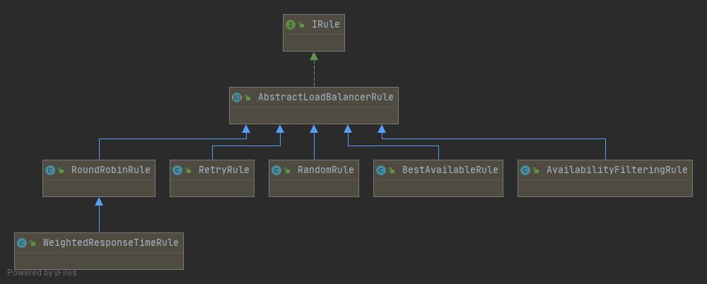

### Ribbon核心组件IRule

#### IRule作用

根据特定算法从服务列表中选择一个要访问的服务

#### 负载均衡算法IRule接口实现图

#### 具体实现

+ 轮询 `com.netflix.loadbalancer.RoundRobinRule`

+ 随机 `com.netflix.loadbalancer.RandomRule`

+ 先按照RoundRobinRule的策略获取服务，如果获取服务失败则在指定时间内进行重试 `com.netflix.loadbalancer.RetryRule`

+ 对RoundRobinRule的扩展，响应速度越快的实例选择权重越大 `com.netflix.loadbalancer.WeightedResponseTimeRule`

+ 先过滤掉由于多次访问故障二处于断路器跳闸状态的实例，然后选择一个并发量最小的服务 `com.netflix.loadbalancer.BestAvailableRule`

+ 先过滤掉故障实例，再选择并发较小的实例 `com.netflix.loadbalancer.AvailabilityFilteringRule`

+ 默认规则，复合判断server所在区域的性能和server的可用性选择服务器 `com.netflix.loadbalancer.ZoneAvoidanceRule`

#### 替换默认规则

+ 不能将配置类放在@ComponentScan 扫描到的包路径下

+ 新建不会被主启动类扫描到的包，在其下新建配置类，返回IRule组件实例

+ 主启动类指定 `@RibbonClient(name = "CLOUD-PAYMENT-SERVICE",configuration = IRuleConfig.class)`

#### 负载均衡算法

通过取余算法实现，接口请求次数 % 服务集群总数量 = 实际调用服务器位置下标

#### 类图如何得到

+ idea 开发工具

+ 切换到指定类（ctrl + alt + 单机类名 可看到实现）

+ `ctrl + alt + shift + u`

+ `java Class Diagrams`

+ 查看父级 `ctrl + alt + p 或右击弹窗选择 `

+ 查看实现（子级） `ctrl + alt + B 或右击弹窗选择 `
